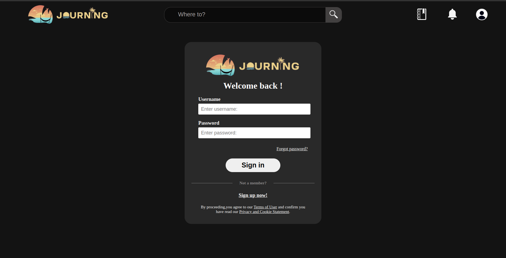
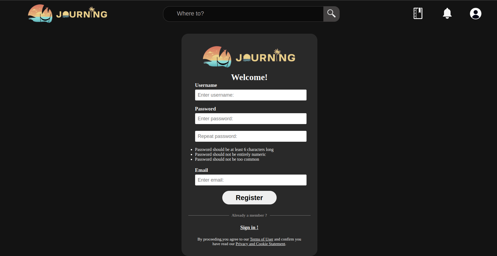

# Journing

## Table of Contents
- [Overview](#Overview)
- [Documentations](#Documentations)
- [Disclaimer](#Disclaimer)

## Overview
An innovative web application developed using the Django framework in conjunction with JQuery, designed to facilitate seamless user interaction with comprehensive travel information - which was pre-scrapped from ctrip.com and are stored in the local postgres database. This platform empowers users to efficiently navigate and explore travel-related data, engage in commentary, establish interconnected communities, and notably, plan and curate individualized travel itineraries.

The web page provides several key functions which includes but not limited to :
1. User authentication and registration

3. Browse travel information ( Data scrapped from the chinese version of trip.com --> ctrip.com )

4. Establish connection between users 

5. View and make comments on attractions or topics

6. Mark attractions/restaurants/shops 

7. Customize personal travel plan with the pre-marked collections

## Installation
Follow the installation step and set up the project.
  
1.  **Clone the Repository:** Begin by cloning this project to your local repository using : 
`git clone https://github.com/NDH001/Journing.git`
2.  **Install Dependencies:** Navigate to the project directory and install the required dependencies by running: `pip install -r requirements.txt`
3. **Database Migration:** Apply the necessary database migrations with the following command:
`python manage.py migrate`
4. **Import Data:** Import the pre-scrapped travel data to the postgres database by running : `psql your_database_name < migrates.sql`
5. **Run the Development Server:** Launch the development server using: `python manage.py runserver`

