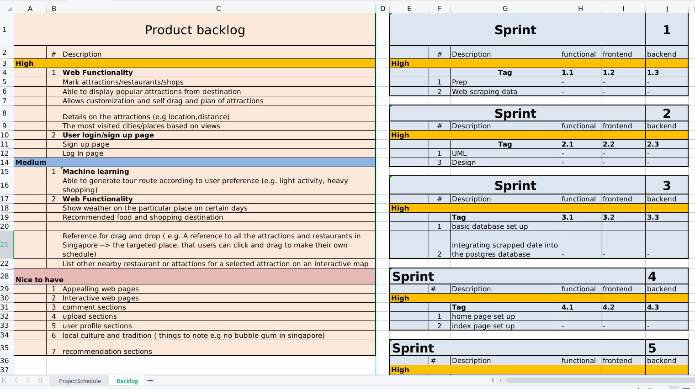
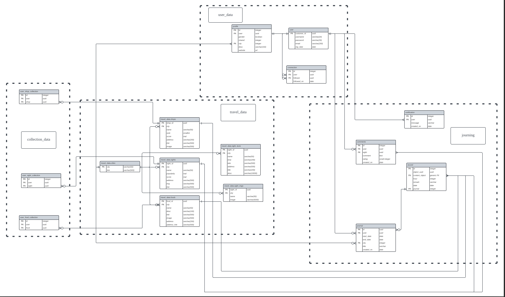

# Journing - Django and JQuery based web application

## Table of Contents
- [Overview](#Overview)
- [RESTFUL API](#RESTFUL_API)
- [Installation](#Installation)
- [Documentations](#Documentations)
- [Disclaimer](#Disclaimer)
 
## Overview
An innovative web application developed using the Django framework in conjunction with JQuery, designed to facilitate seamless user interaction with comprehensive travel information - which was pre-scrapped from ctrip.com and are stored in the local postgres database. This platform empowers users to efficiently navigate and explore travel-related data, engage in commentary, establish interconnected communities, and notably, plan and curate individualized travel itineraries.

The web page provides several key functions which includes but not limited to :

**1. User authentication and registration**

**2. Browse travel information ( Data scrapped from the chinese version of trip.com --> ctrip.com )**

**3. Establish connection between users**

**4. View and make comments on attractions or topics**

**5. Mark attractions/restaurants/shops** 

**6. Customize personal travel plan with the pre-marked collections**

#### Responsive mobile design 
Although the project was built with desktop users as the main audience, however, most of the features can also be access through mobile phones with proper responsive design. 
Tested with IPhone Xr and Oppo R17 , this does **not** guarantee proper styling on all mobile devices.
 

## RESTFUL_API
The website also supports restful API calls from external sources and full CRUD support is available for certain functionalities.
To GET data such as attracts,foods and shops, make a GET request to `https://journing.co/api/<?>` with <?> being either sights,foods or shops.

 

## Installation
Follow the installation step and set up the project.
  
1.  **Clone the Repository:** Begin by cloning this project to your local repository using : 
`git clone https://github.com/NDH001/Journing.git`
2.  **Install Dependencies:** Navigate to the project directory and install the required dependencies by running: `pip install -r requirements.txt`
3. **Database Migration:** Apply the necessary database migrations with the following command:
`python manage.py migrate`
4. **Import Data:** Import the pre-scrapped travel data to the postgres database by running : `psql your_database_name < migrates.sql` ( the csv files are not provided here , please contact me at zhi_jun23@hotmail.com for the csv files)
5. **Run the Development Server:** Launch the development server using: `python manage.py runserver`

## Documentations
The objective of this segment is to furnish comprehensive elucidation pertaining to the project in question. The documentation encompassing elements such as the product backlog, database schemas, prototyping documents, and the Gantt chart, is enumerated herewith.

**1. Product backlog & Gantt Chart :** The project is founded upon an Agile methodology coupled with the Scrum framework. Each week is designated as a discrete sprint, wherein the activities encompass the stages of application development, thorough review, and rigorous testing. The project encompasses a timeline extending over a duration of three months, commencing with data scraping and subsequently progressing to the substantive phases of application development.

**2. Data Scrapping :** The data available on the website is pre-scrapped from ctrip.com, this [project](https://github.com/NDH001/travelWeb_scrapper) has detailed source code and steps on how to scrap for data used in this project.

**3. Database schemas :** The database consist of  4 schemas , each segement responsible for storing related data and contents. Click [here](project_imgs/database.pdf) for the original pdf.

**4. Prototye:** This subsection contains some of the initial design and ideas for the website. Click [here](project_imgs/) to view the original images.
 

## Disclaimer

This project is strictly non-profit and is solely intended for personal use. All data presented or utilized in this project has been obtained from ctrip.com through legal web scraping methods. The intention behind this project is to showcase technical skills and provide insights derived from publicly available data. No commercial intent or financial gain is associated with this project.

Please note that this project is not affiliated with or endorsed by ctrip.com in any way. The data used is publicly accessible information that has been collected through lawful means. If you are the owner or representative of ctrip.com and have concerns about the usage of this data, please feel free to me at zhi_jun23@hotmail.com, and I will be glad to address any inquiries. 

